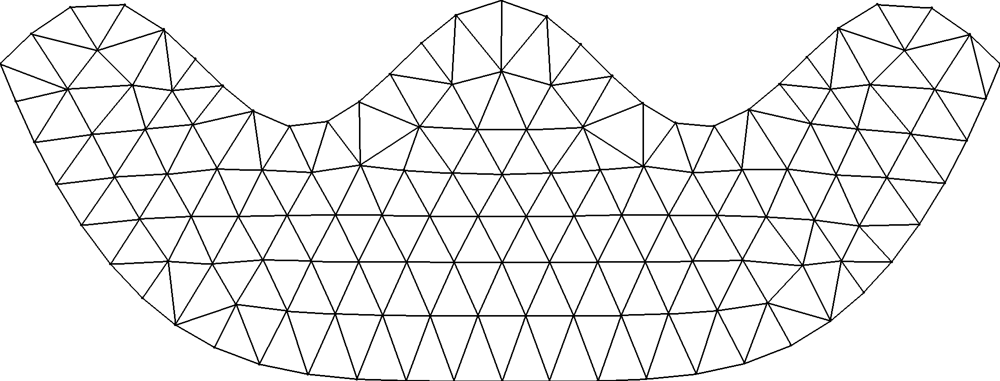
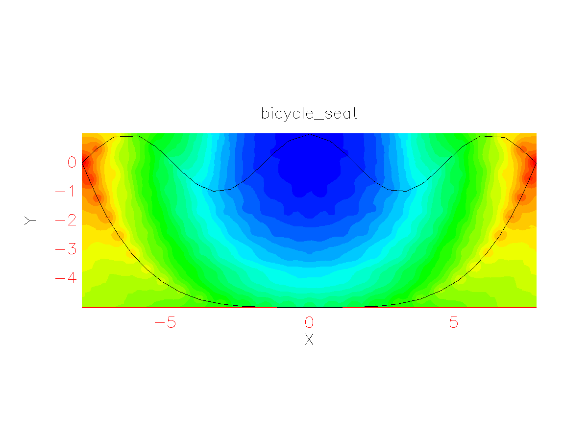
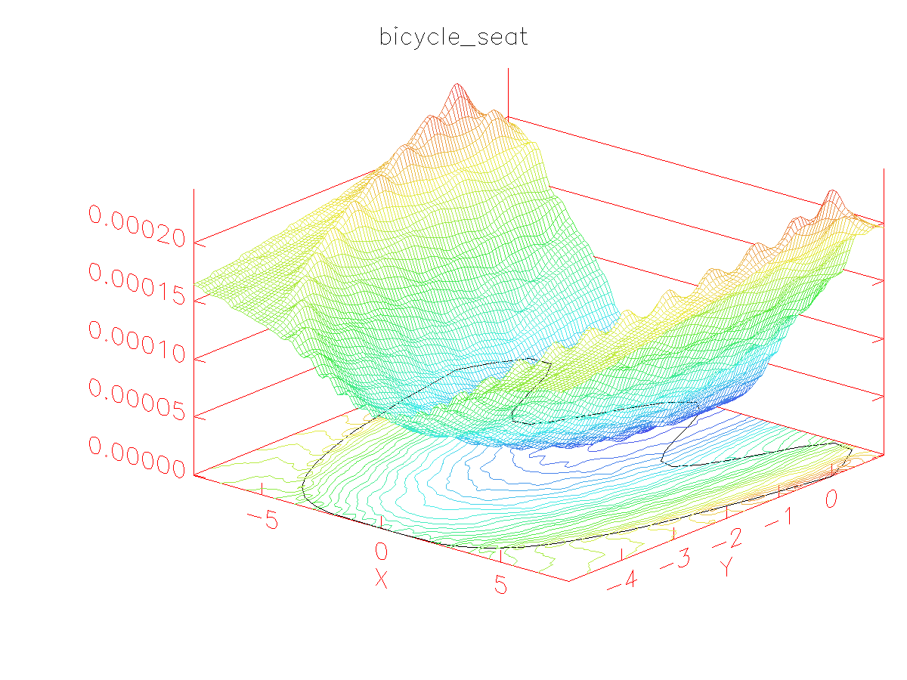

# Finite Element Method Solver for 2D Poisson Problems


This package takes a .poly file that defines the problem boundary
(see [here](https://www.cs.cmu.edu/~quake/triangle.poly.html) to understand the file format)
and solves the 2D screened Poisson equation:
```math
\Delta u(x,y) - u(x,y) = -f(x,y)
```

subject to the Dirichlet boundary condition:
```math
u(x,y) = {x^2 + y^2 \over 250000}
```

(The problem can be modified by editing `prob_def.c`)

This was for a university project in 2011.


## Usage

### Installation
```bash
# in <root>/
git clone https://github.com/mm318/fem-solver-2d-poisson.git
```

### Build
```bash
# from <root>/
mkdir build
cd build
cmake ../fem-solver-2d-poisson
make
```

### Run
Usage:
```text
FEM_Solver <.poly file>
```

Example:
```bash
# from <root>/build/
cd bin  # current working directory needs to have the plstnd5.fnt and plxtnd5.fnt files
./FEM_Solver bicycle_seat # exclude the .poly extension
```

Resulting mesh:  


Resulting solution:  
  



## Requirements

Tested on Ubuntu 20.04 and Ubuntu 22.04.

## Dependencies

- [FEM2D_POISSON](https://people.math.sc.edu/Bu/rkardt/cpp_src/fem2d_poisson_cg/fem2d_poisson_cg.html) - LGPL
- [Triangle](https://www.cs.cmu.edu/~quake/triangle.html) - Non-commercial use
- [PLplot](https://plplot.sourceforge.net/) - LGPL
- [libgd](https://libgd.github.io/) - BSD-like
- [libpng](http://www.libpng.org/pub/png/libpng.html) - The zlib/libpng License
- [zlib](https://zlib.net/) - The zlib/libpng License
